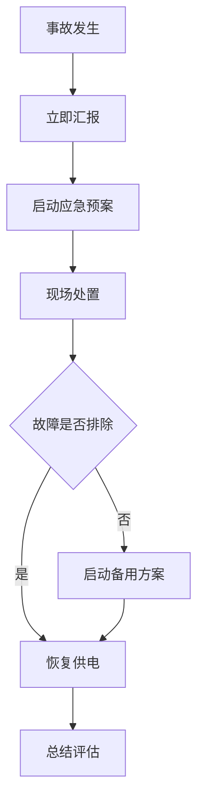

# 重要活动保电方案

**方案编号**: {{ plan_no }}  
**编制日期**: {{ plan_date }}  
**编制人**: {{ planner|default("________") }}  
**审核人**: {{ reviewer|default("________") }}  
**批准人**: {{ approver|default("________") }}

---

## 一、保电任务概述

### 1.1 活动基本信息

**活动名称**: {{ activity_name }}  
**活动时间**: {{ activity_time }}  
**活动地点**: {{ activity_location }}  
**重要性等级**: {{ importance_level }}  
**主办单位**: {{ organizer }}

### 1.2 保电要求



- {{ req }}


- 保电期间供电可靠率100%
- 不得发生停电事故
- 应急响应时间≤5分钟


---

## 二、供电现状分析

### 2.1 供电路径

```mermaid
graph LR


    {{ path.from_node }}[{{ path.from_desc }}] -->|{{ path.line }}| {{ path.to_node }}[{{ path.to_desc }}]


    A[电源点] --> B[主变] --> C[配电室] --> D[用户]

```

### 2.2 关键设备状态


| 设备名称 | 设备类型 | 运行状态 | 健康状况 | 备注 |
|----------|----------|----------|----------|------|

| {{ eq.name }} | {{ eq.type }} | {{ eq.status }} | {{ eq.health }} | {{ eq.note|default("") }} |


| 设备名称 | 设备类型 | 运行状态 | 健康状况 | 备注 |
|----------|----------|----------|----------|------|
| 待填写 | ________ | ________ | ________ | ________ |


### 2.3 历史运行情况


**近期运行记录**:

- {{ record.date }}: {{ record.event }}


**近期运行记录**: 待补充


---

## 三、风险评估

### 3.1 风险识别


| 序号 | 风险类型 | 风险描述 | 发生概率 | 影响程度 | 风险等级 |
|------|----------|----------|----------|----------|----------|

| {{ loop.index }} | {{ risk.type }} | {{ risk.description }} | {{ risk.probability }} | {{ risk.impact }} | {{ risk.level }} |


| 序号 | 风险类型 | 风险描述 | 发生概率 | 影响程度 | 风险等级 |
|------|----------|----------|----------|----------|----------|
| 1 | 设备故障 | 待分析 | ________ | ________ | ________ |
| 2 | 外力破坏 | 待分析 | ________ | ________ | ________ |
| 3 | 自然灾害 | 待分析 | ________ | ________ | ________ |


### 3.2 风险矩阵

**高风险项**: {{ high_risks|default("待识别") }}  
**中风险项**: {{ medium_risks|default("待识别") }}  
**低风险项**: {{ low_risks|default("待识别") }}

---

## 四、保电措施

### 4.1 运行方式优化



#### {{ opt.title }}

**优化内容**: {{ opt.content }}  
**实施时间**: {{ opt.time }}  
**责任人**: {{ opt.responsible }}  
**预期效果**: {{ opt.effect }}


#### 措施1: 运行方式调整

**优化内容**: 待制定  
**实施时间**: 保电前__天  
**责任人**: ________  
**预期效果**: 提高供电可靠性


### 4.2 设备检修与消缺


| 序号 | 设备名称 | 检修内容 | 计划时间 | 责任人 | 完成情况 |
|------|----------|----------|----------|--------|----------|

| {{ loop.index }} | {{ item.equipment }} | {{ item.content }} | {{ item.time }} | {{ item.responsible }} | [ ] 已完成 [ ] 进行中 |


| 序号 | 设备名称 | 检修内容 | 计划时间 | 责任人 | 完成情况 |
|------|----------|----------|----------|--------|----------|
| 1 | ________ | ________ | ________ | ________ | [ ] 已完成 [ ] 进行中 |


### 4.3 特巡与监控


**巡检安排**:

- **{{ patrol.time }}**: {{ patrol.route }}
  - 巡检人员: {{ patrol.personnel }}
  - 重点部位: {{ patrol.key_points }}


**巡检安排**:
- **保电前3天**: 全面巡检
- **保电期间**: 加密巡检（每__小时一次）
- **保电结束**: 总结巡检


### 4.4 应急资源准备


| 资源类别 | 资源名称 | 数量 | 存放位置 | 负责人 | 状态 |
|----------|----------|------|----------|--------|------|

| {{ resource.category }} | {{ resource.name }} | {{ resource.quantity }} | {{ resource.location }} | {{ resource.responsible }} | {{ resource.status }} |


| 资源类别 | 资源名称 | 数量 | 存放位置 | 负责人 | 状态 |
|----------|----------|------|----------|--------|------|
| 抢修队伍 | ________ | ________ | ________ | ________ | [ ] 就位 |
| 备品备件 | ________ | ________ | ________ | ________ | [ ] 就位 |
| 应急车辆 | ________ | ________ | ________ | ________ | [ ] 就位 |
| 应急电源 | ________ | ________ | ________ | ________ | [ ] 就位 |


---

## 五、应急预案

### 5.1 应急组织架构

**总指挥**: {{ commander|default("________") }}  
**副总指挥**: {{ vice_commander|default("________") }}


**应急小组**:

- **{{ team.name }}**
  - 组长: {{ team.leader }}
  - 成员: {{ team.members }}
  - 职责: {{ team.responsibility }}


**应急小组**:
- **现场处置组**: 待组建
- **技术支持组**: 待组建
- **后勤保障组**: 待组建
- **信息联络组**: 待组建


### 5.2 应急响应流程



### 5.3 故障处置方案



#### 场景{{ loop.index }}: {{ scenario.title }}

**故障描述**: {{ scenario.description }}  
**影响范围**: {{ scenario.impact }}  
**处置措施**:

{{ loop.index }}. {{ measure }}

**预计恢复时间**: {{ scenario.recovery_time }}


#### 场景1: 主供线路故障

**故障描述**: 待制定  
**影响范围**: 待分析  
**处置措施**: 待制定  
**预计恢复时间**: 待评估


### 5.4 通信联络


| 角色 | 姓名 | 电话 | 备用电话 |
|------|------|------|----------|

| {{ contact.role }} | {{ contact.name }} | {{ contact.phone }} | {{ contact.backup_phone|default("") }} |


| 角色 | 姓名 | 电话 | 备用电话 |
|------|------|------|----------|
| 总指挥 | ________ | ________ | ________ |
| 现场负责人 | ________ | ________ | ________ |
| 调度 | ________ | ________ | ________ |
| 抢修队长 | ________ | ________ | ________ |


---

## 六、保电时间表


| 时间节点 | 工作内容 | 责任人 | 完成标准 | 检查人 |
|----------|----------|--------|----------|--------|

| {{ item.time }} | {{ item.task }} | {{ item.responsible }} | {{ item.standard }} | {{ item.checker }} |


| 时间节点 | 工作内容 | 责任人 | 完成标准 | 检查人 |
|----------|----------|--------|----------|--------|
| 保电前7天 | 制定保电方案 | ________ | 方案审批通过 | ________ |
| 保电前5天 | 设备检修消缺 | ________ | 缺陷全部消除 | ________ |
| 保电前3天 | 全面巡检 | ________ | 无异常 | ________ |
| 保电前1天 | 应急演练 | ________ | 演练合格 | ________ |
| 保电期间 | 值守监控 | ________ | 24小时值守 | ________ |
| 保电结束 | 总结评估 | ________ | 形成总结报告 | ________ |


---

## 七、保障措施

### 7.1 组织保障

{{ organizational_guarantee|default("待制定") }}

### 7.2 技术保障

{{ technical_guarantee|default("待制定") }}

### 7.3 物资保障

{{ material_guarantee|default("待制定") }}

### 7.4 资金保障

{{ financial_guarantee|default("待制定") }}

---

## 八、附件



- {{ attachment.name }}: {{ attachment.description }}


- 供电系统接线图
- 应急预案详细版
- 应急演练方案
- 联系人通讯录


---

## 审批意见

### 审核意见

**审核人**: {{ reviewer|default("________") }}  
**审核日期**: {{ review_date|default("________") }}  
**审核意见**: {{ review_comment|default("") }}

### 批准意见

**批准人**: {{ approver|default("________") }}  
**批准日期**: {{ approval_date|default("________") }}  
**批准意见**: {{ approval_comment|default("") }}

---

*本保电方案由ApeRAG智能体系统自动生成，请专业人员审核批准后执行*
