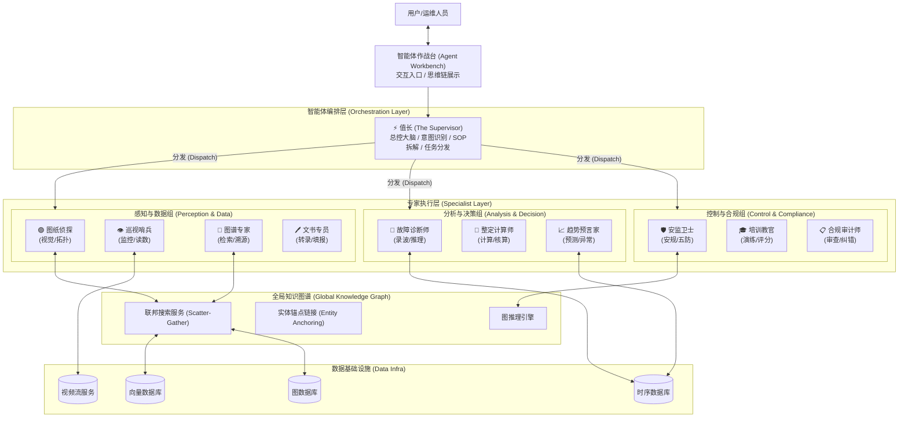

```mermaid
graph TD
    User["用户/运维人员"] <--> Workbench["智能体作战台 (Agent Workbench)<br/>交互入口 / 思维链展示"]

    subgraph Orchestration ["智能体编排层 (Orchestration Layer)"]
        Supervisor["⚡ 值长 (The Supervisor)<br/>总控大脑 / 意图识别 / SOP拆解 / 任务分发"]
    end

    Workbench --> Supervisor

    subgraph SpecialistLayer ["专家执行层 (Specialist Layer)"]
        direction TB

        subgraph Group1 ["感知与数据组 (Perception & Data)"]
            direction LR
            Detective["🟣 图纸侦探<br/>(视觉/拓扑)"]
            Sentinel["👁️ 巡视哨兵<br/>(监控/读数)"]
            Archivist["🔶 图谱专家<br/>(检索/溯源)"]
            Scribe["🖊️ 文书专员<br/>(转录/填报)"]
        end

        subgraph Group2 ["分析与决策组 (Analysis & Decision)"]
            direction LR
            Diagnostician["🔴 故障诊断师<br/>(录波/推理)"]
            Calculator["🧮 整定计算师<br/>(计算/核算)"]
            Prophet["📈 趋势预言家<br/>(预测/异常)"]
        end

        subgraph Group3 ["控制与合规组 (Control & Compliance)"]
            direction LR
            Gatekeeper["🛡️ 安监卫士<br/>(安规/五防)"]
            Instructor["🎓 培训教官<br/>(演练/评分)"]
            Auditor["📋 合规审计师<br/>(审查/纠错)"]
        end
    end

    Supervisor --"分发 (Dispatch)"--> Group1 & Group2 & Group3

    subgraph KG ["全局知识图谱 (Global Knowledge Graph)"]
        FederatedSearch["联邦搜索服务 (Scatter-Gather)"]
        EntityLink["实体锚点链接 (Entity Anchoring)"]
        ReasoningEngine["图推理引擎"]
    end

    Archivist <--> FederatedSearch
    Detective <--> FederatedSearch
    Gatekeeper <--> ReasoningEngine

    subgraph DataInfra ["数据基础设施 (Data Infra)"]
        direction LR
        VectorDB[("向量数据库")]
        GraphDB[("图数据库")]
        TimeSeries[("时序数据库")]
        VideoStore[("视频流服务")]
    end

    FederatedSearch <--> VectorDB & GraphDB
    Diagnostician <--> TimeSeries
    Prophet <--> TimeSeries
    Sentinel <--> VideoStore
```
