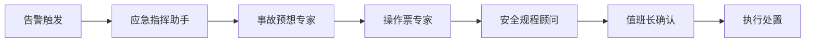
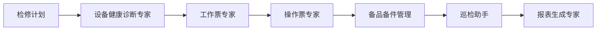

# 变电站智能体生态系统设计方案

> **设计时间**: 2025-12-01  
> **场景**: 变电站全时空巡检与智能运维  
> **设计理念**: 专家团队协作 + 领域知识增强 + 人机回环

---

## 📋 目录

1. [已实现智能体](#已实现智能体)
2. [核心运维智能体](#核心运维智能体)
3. [安全管控智能体](#安全管控智能体)
4. [设备管理智能体](#设备管理智能体)
5. [数据分析智能体](#数据分析智能体)
6. [培训与辅助智能体](#培训与辅助智能体)
7. [智能体协作模式](#智能体协作模式)
8. [实现优先级建议](#实现优先级建议)

---

## 已实现智能体

### 1. 📚 图谱专家 (Archivist Agent)
**状态**: ✅ 已实现

**核心能力**:
- 知识库检索（向量 + 图谱 + 全文混合检索）
- 图谱关系遍历（设备拓扑分析）
- 历史数据查询（时间序列检索）

**典型场景**:
```
用户: "查询1号主变的保护配置"
智能体: [检索设备台账] → [查找保护定值] → [返回结构化数据]
```

### 2. ⚡ 事故预想专家 (Accident Deduction Agent)
**状态**: ✅ 已实现

**核心能力**:
- 事故场景推演（因果链分析）
- 应急预案生成（结构化输出）
- 应急演练设计（脚本生成）

**典型场景**:
```
用户: "#1主变重瓦斯保护动作事故预想"
智能体: [检索历史案例] → [LLM推演] → [生成预案报告]
```

### 3. 🎯 值班长 (Supervisor Agent)
**状态**: ✅ 已实现

**核心能力**:
- 任务意图识别（LLM + 规则回退）
- 多智能体协作调度（并行/串行模式）
- 结果整合与汇报

---

## 核心运维智能体

### 4. 🔧 操作票专家 (Operation Ticket Agent)
**优先级**: ⭐⭐⭐⭐⭐ (最高)

**设计思路**:
变电站的"两票三制"是安全生产的生命线。操作票专家必须做到**零容错、强约束**。

**核心能力**:
1. **智能生成操作票**
   - 输入: "将1号主变由运行转检修"
   - 输出: 标准化的倒闸操作步骤（含安全措施）
   
2. **逻辑闭锁检查**
   - 防误操作校验（如：先断开关，再拉隔离）
   - 设备状态一致性检查
   
3. **操作票审核**
   - 基于规程的合规性检查
   - 危险点识别与提示

**技术实现**:
```python
class OperationTicketAgent(BaseAgent):
    async def _execute(self, state, input_data):
        # 1. 解析操作意图
        operation_type = self._parse_operation_intent(input_data['task'])
        
        # 2. 检索操作模板
        template = await self._search_operation_template(operation_type)
        
        # 3. 生成操作步骤（基于图谱拓扑）
        steps = await self._generate_operation_steps(
            equipment=input_data['equipment'],
            target_state=input_data['target_state'],
            topology=await self._get_topology_from_graph()
        )
        
        # 4. 逻辑闭锁检查
        validation_result = self._validate_operation_logic(steps)
        
        # 5. 渲染操作票
        ticket = await self.render_with_template(
            template_name="operation_ticket.md",
            context={
                "ticket_no": self._generate_ticket_no(),
                "steps": steps,
                "safety_measures": validation_result['safety_measures']
            }
        )
        
        return {"ticket": ticket, "validation": validation_result}
```

**数据结构示例**:
```json
{
  "ticket_no": "OT-2025-1201-001",
  "operation_type": "主变转检修",
  "equipment": "#1主变压器",
  "steps": [
    {
      "seq": 1,
      "operation": "断开1号主变110kV侧断路器1011",
      "executor": "操作人",
      "supervisor": "监护人",
      "safety_note": "确认无负荷后操作"
    },
    {
      "seq": 2,
      "operation": "拉开1号主变110kV侧隔离开关1012",
      "executor": "操作人",
      "supervisor": "监护人",
      "safety_note": "确认断路器已断开"
    }
  ],
  "safety_measures": [
    "验电",
    "装设接地线",
    "悬挂标示牌"
  ]
}
```

---

### 5. 📋 工作票专家 (Work Permit Agent)
**优先级**: ⭐⭐⭐⭐⭐

**设计思路**:
工作票是检修作业的"通行证"，必须明确危险点和安全措施。

**核心能力**:
1. **工作票生成**
   - 输入: "1号主变例行检修"
   - 输出: 第一种/第二种工作票
   
2. **危险点辨识**
   - 基于作业内容自动识别危险点
   - 匹配对应的安全措施
   
3. **作业范围划定**
   - 根据设备图纸标注作业区域
   - 生成安全围栏布置图

**关键字段**:
```json
{
  "permit_no": "WP-2025-1201-001",
  "work_type": "第一种工作票",
  "work_content": "1号主变例行检修",
  "work_location": "1号主变间隔",
  "hazard_points": [
    {
      "hazard": "带电部位",
      "level": "高危",
      "control_measure": "装设遮栏，悬挂警示牌"
    },
    {
      "hazard": "高空作业",
      "level": "中危",
      "control_measure": "系安全带，设专人监护"
    }
  ],
  "safety_measures": [
    "停电",
    "验电",
    "装设接地线",
    "悬挂标示牌和装设遮栏"
  ]
}
```

---

### 6. 🔍 巡检助手 (Inspection Assistant Agent)
**优先级**: ⭐⭐⭐⭐

**设计思路**:
结合视觉AI和知识图谱，实现智能化巡检。

**核心能力**:
1. **巡检路径规划**
   - 基于设备重要性和历史缺陷生成最优路径
   
2. **缺陷识别与分类**
   - 接入视觉模型识别设备异常（油位、表计、开关位置）
   - 自动分类缺陷等级（紧急/重要/一般）
   
3. **巡检报告生成**
   - 自动汇总巡检发现
   - 关联历史缺陷趋势

**工作流程**:
```
巡检员拍照 → 视觉模型识别 → 智能体分析 → 生成缺陷单
```

**示例输出**:
```markdown
## 巡检报告 - 2025-12-01

### 发现缺陷
1. **#1主变油位异常** (紧急)
   - 位置: 主变本体油位计
   - 现象: 油位低于正常值
   - 建议: 立即检查是否漏油，必要时补油

2. **10kV母线避雷器计数器动作** (重要)
   - 位置: 10kV I段母线
   - 现象: 避雷器动作计数器增加
   - 建议: 安排试验，检查避雷器性能
```

---

### 7. 📊 设备健康诊断专家 (Equipment Health Agent)
**优先级**: ⭐⭐⭐⭐

**设计思路**:
基于设备运行数据和历史趋势，预测设备健康状态。

**核心能力**:
1. **状态评估**
   - 输入: 设备运行数据（温度、电流、油色谱等）
   - 输出: 健康度评分（0-100）
   
2. **故障预测**
   - 基于时间序列分析预测潜在故障
   - 提前X天预警
   
3. **检修建议**
   - 根据设备状态推荐检修策略（预防性/状态检修）

**数据驱动**:
```python
async def _evaluate_health(self, equipment_id):
    # 1. 获取设备运行数据
    data = await self._get_equipment_data(equipment_id)
    
    # 2. 特征提取
    features = {
        "temperature_trend": self._analyze_trend(data['temperature']),
        "oil_chromatography": data['oil_analysis'],
        "partial_discharge": data['pd_level']
    }
    
    # 3. 健康度评分（可接入ML模型）
    health_score = self._calculate_health_score(features)
    
    # 4. 生成诊断报告
    return {
        "health_score": health_score,
        "risk_level": "高" if health_score < 60 else "中" if health_score < 80 else "低",
        "recommendations": self._generate_recommendations(features)
    }
```

---

## 安全管控智能体

### 8. 🛡️ 安全规程顾问 (Safety Regulation Advisor)
**优先级**: ⭐⭐⭐

**设计思路**:
变电站作业必须严格遵守《安规》，该智能体作为"规程活字典"。

**核心能力**:
1. **规程查询**
   - 用户: "高压设备验电的要求是什么？"
   - 智能体: [检索《安规》] → 返回相关条款
   
2. **合规性检查**
   - 输入: 操作票/工作票
   - 输出: 不符合项及整改建议
   
3. **案例学习**
   - 检索历史违章案例
   - 提供警示教育

---

### 9. 🚨 应急指挥助手 (Emergency Command Assistant)
**优先级**: ⭐⭐⭐⭐

**设计思路**:
在事故发生时，协助值班长快速决策。

**核心能力**:
1. **事故快速诊断**
   - 输入: 告警信息（如"主变差动保护动作"）
   - 输出: 可能原因 + 初步处置建议
   
2. **应急资源调度**
   - 自动生成应急人员/物资清单
   - 联系方式快速查询
   
3. **上级汇报材料生成**
   - 自动整理事故经过
   - 生成事故快报

**实时协作**:
```
事故发生 → 智能体接收告警 → 推送处置建议 → 值班长确认 → 执行
```

---

## 设备管理智能体

### 10. 📦 备品备件管理专家 (Spare Parts Manager)
**优先级**: ⭐⭐⭐

**核心能力**:
1. **库存查询**
   - "查询110kV避雷器库存"
   
2. **采购建议**
   - 基于设备台账和故障率预测备件需求
   
3. **替代方案推荐**
   - 当原型号缺货时，推荐可替代型号

---

### 11. 🔄 设备台账助手 (Equipment Ledger Assistant)
**优先级**: ⭐⭐⭐

**核心能力**:
1. **台账查询**
   - "1号主变的出厂日期是什么时候？"
   
2. **台账更新提醒**
   - 设备参数变更时自动提醒更新台账
   
3. **全生命周期追踪**
   - 从安装 → 运行 → 检修 → 退役的完整记录

---

## 数据分析智能体

### 12. 📈 运行数据分析师 (Operation Data Analyst)
**优先级**: ⭐⭐⭐

**设计思路**:
将海量的SCADA数据转化为可操作的洞察。

**核心能力**:
1. **负荷分析**
   - 生成负荷曲线报告
   - 识别负荷异常
   
2. **电能质量分析**
   - 谐波、电压波动分析
   
3. **趋势预测**
   - 预测未来X天的负荷趋势

**可视化输出**:
- 自动生成图表（折线图、柱状图）
- 生成月度/年度运行报告

---

### 13. 📝 报表生成专家 (Report Generator)
**优先级**: ⭐⭐

**核心能力**:
1. **自动化报表**
   - 日报、周报、月报自动生成
   
2. **定制化报表**
   - 用户: "生成2025年11月的设备缺陷统计报表"
   
3. **多格式导出**
   - Word、Excel、PDF

---

## 培训与辅助智能体

### 14. 🎓 培训教练 (Training Coach)
**优先级**: ⭐⭐

**设计思路**:
帮助新员工快速上手，老员工温故知新。

**核心能力**:
1. **知识问答**
   - "什么是差动保护？"
   
2. **模拟考试**
   - 生成考题并自动评分
   
3. **案例教学**
   - 基于历史事故生成教学案例

---

### 15. 🗣️ 语音助手 (Voice Assistant)
**优先级**: ⭐⭐

**设计思路**:
解放双手，语音交互。

**核心能力**:
1. **语音查询**
   - "小智，查询1号主变的运行状态"
   
2. **语音记录**
   - 巡检时语音记录缺陷
   
3. **语音播报**
   - 重要告警语音提醒

---

## 智能体协作模式

### 场景1: 设备故障处理全流程



**协作流程**:
1. **应急指挥助手**: 接收告警，初步诊断
2. **事故预想专家**: 推演事故后果
3. **操作票专家**: 生成隔离操作票
4. **安全规程顾问**: 检查合规性
5. **值班长**: 人工确认后执行

---

### 场景2: 计划检修全流程



---

## 实现优先级建议

### 第一阶段（核心运维）- 3个月
1. ✅ 图谱专家（已完成）
2. ✅ 事故预想专家（已完成）
3. 🔧 **操作票专家** ⭐⭐⭐⭐⭐
4. 📋 **工作票专家** ⭐⭐⭐⭐⭐

**理由**: "两票"是变电站最高频、最刚需的业务，必须优先实现。

---

### 第二阶段（智能化升级）- 3个月
5. 🔍 **巡检助手** ⭐⭐⭐⭐
6. 📊 **设备健康诊断专家** ⭐⭐⭐⭐
7. 🚨 **应急指挥助手** ⭐⭐⭐⭐

**理由**: 提升运维效率，从被动响应到主动预防。

---

### 第三阶段（生态完善）- 6个月
8. 🛡️ 安全规程顾问
9. 📦 备品备件管理专家
10. 🔄 设备台账助手
11. 📈 运行数据分析师
12. 📝 报表生成专家
13. 🎓 培训教练
14. 🗣️ 语音助手

---

## 技术实现建议

### 1. 统一的智能体框架
所有智能体继承自 `BaseAgent`，复用以下能力：
- MCP工具调用
- RAG检索
- 思维链记录
- 模板渲染

### 2. 领域知识库建设
每个智能体需要专属的知识库：
- **操作票专家**: 操作规程、操作模板
- **工作票专家**: 安规、危险点库
- **设备健康专家**: 设备手册、试验标准

### 3. 人机回环机制
关键操作必须人工确认：
- 操作票生成后 → 值班长审核
- 应急处置建议 → 值班长决策
- 设备停运 → 调度许可

### 4. 可观测性
- 每个智能体的调用日志
- 思维链完整记录
- 用户反馈收集

---

## 总结

这套智能体生态系统覆盖了变电站运维的**全业务链条**：

- **事前**: 设备健康诊断、巡检助手
- **事中**: 应急指挥、事故预想
- **事后**: 报表生成、案例学习

通过**专家团队协作**的模式，每个智能体专注于特定领域，通过值班长（Supervisor）统一调度，形成一个**高效、可靠、可解释**的AI运维系统。

**核心价值**:
1. 🚀 **提效**: 自动化生成操作票、工作票，节省80%时间
2. 🛡️ **安全**: 规程约束 + 逻辑闭锁，降低误操作风险
3. 🧠 **智能**: 从历史数据中学习，预测设备故障
4. 📊 **可视**: 思维链透明，决策过程可追溯
